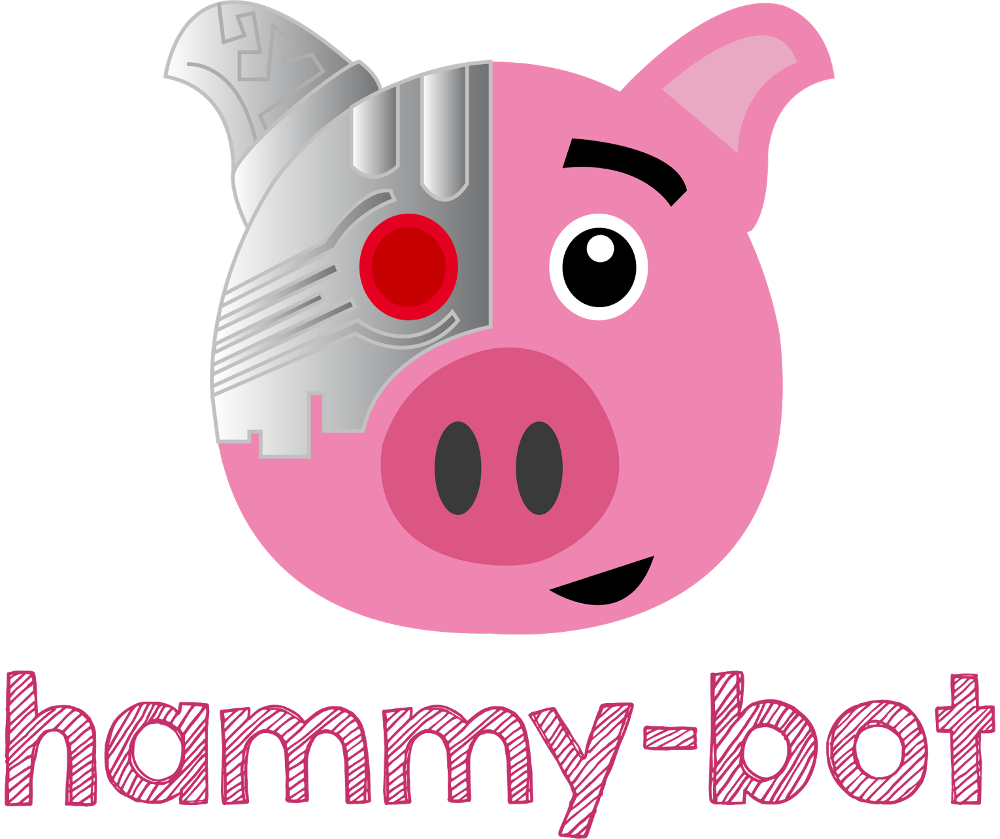

hammy-bot
=========

Modular bot framework for google hangouts built w/ nodejs and [hangupsjs](https://github.com/yakyak/hangupsjs).

Primarily used to monitor group-chats, provide added context to links (tweets, images, animated gifs, etc.) and accept commands from users to perform various tasks. 

** *The end goal is create the bot in a way that it can be easily extended by others, and allow 3rd party plug-ins to be developed to add functionality.*

## APIs currently in use
- [Gfycat](https://gfycat.com/api)
- [Twitter](https://dev.twitter.com/rest/public)
- [XboxAPI](https://xboxapi.com/)
- [Streamable](https://streamable.com/documentation)
